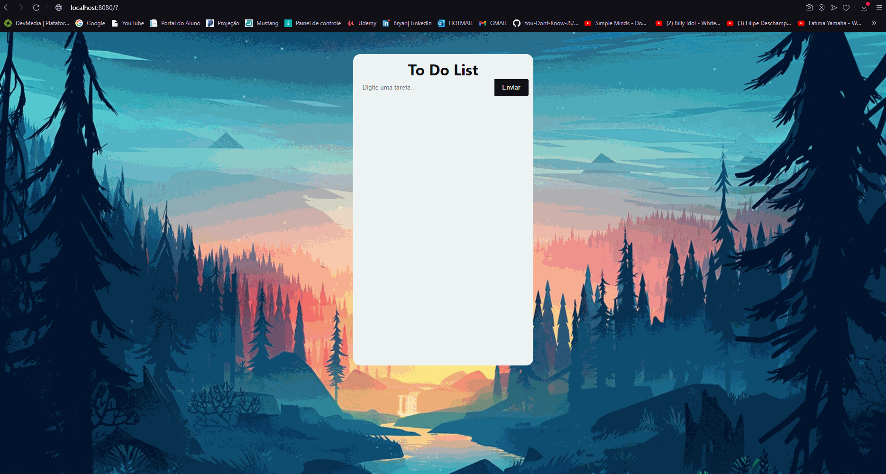

# ToDoList VueJs
<h1 align="center">

  
</h1>

  <a href="#-tecnologias">Tecnologias</a>&nbsp;&nbsp;&nbsp;|&nbsp;&nbsp;&nbsp;
  <a href="#-Objetivo">Objetivo</a>&nbsp;&nbsp;&nbsp;|&nbsp;&nbsp;&nbsp;
  <a href="#-projeto">Projeto</a>&nbsp;&nbsp;&nbsp;|&nbsp;&nbsp;&nbsp;
  <a href="#-how-to-test">How to test?</a>&nbsp;&nbsp;&nbsp;|&nbsp;&nbsp;&nbsp;

 

  

## 🚀 Tecnologias

Esse projeto foi desenvolvido com as seguintes tecnologias:

- VueJS 
- HTML
- CSS
- JavaScript

## 🔖 Objetivo

Projeto simples criado com o objetivo de praticar os conhecimentos adquiridos pelo framework Vue.

## 💻 Projeto

Criar um To Do List.

##  How to test?

    --Open terminal--

    #Clone repo from github
    git clone https://github.com/Ryandls/ToDoList-Vue.git

    #Entry in Rocketpay folder
    cd cd todolist

    #Run project:

    #Install deps
  
    yarn install

    #Run the development server:

    yarn serve

<h3><strong>Created by Bryan.</strong><h3>

